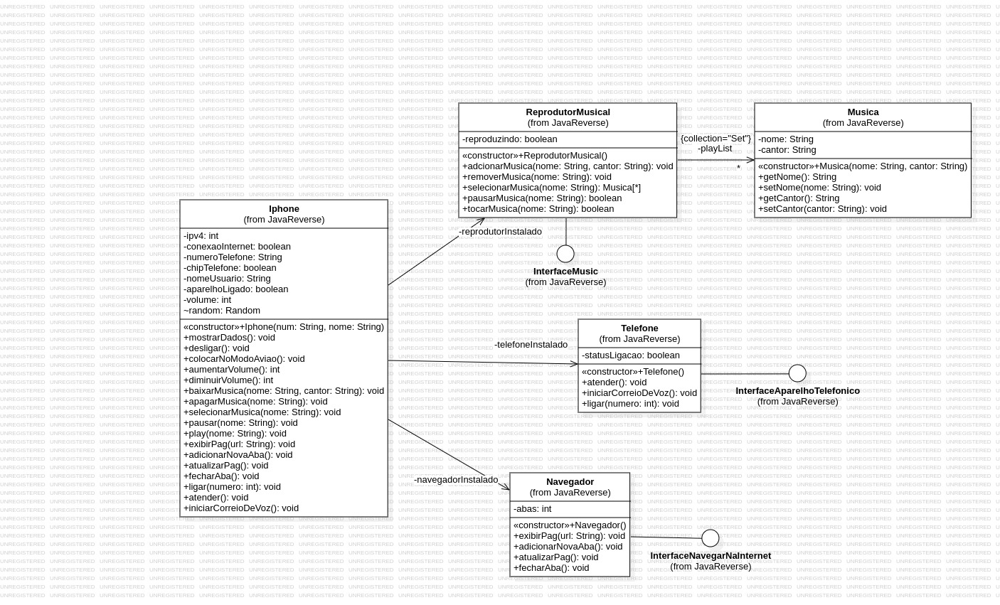

<h1 align="center"> DESAFIO IPHONE</h1>

## Descrição
Esse projeto possui interfaces para implementar os métodos dos aplicativos: Reprodutor Musical, Navegador e Telefone. Além disso, há uma classe auxiliar chamada música para que o reprodutor musical implemente um Set de musicas. 
O navegador busca ter alguns conceitos básicos de redes (podendo melhorar) e o telefone apenas com as funcionalidades básicas exigidas no desafio.

## Funcionalidades
* <b>Funcionalidade 1</b>: Possui um reprdutor musical
* <b>Funcionalidade 2</b>: Possui um navegador
* <b>Funcionalidade 3</b>: Possui um central de ligacões

## Tecnologias utilizadas
* Java
* StarUML

##  Implementação futura
* Map de agenda telefonica, onde a chave será o nome do contato e o valor o número.
* Conceitos de Rede de Computadores.

## Diagrama UML
<table>
  <tr>
    <td align="center">
      <a>
         
        
          <b>Autor: Julia Costa</b>
        
      </a>
    </td>
  </tr>
</table>

## :dart: Status do projeto
Em andamento.